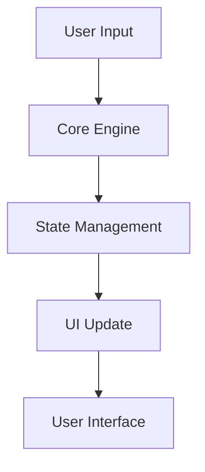

# Architecture

This document explains the architecture of the framework.

## Core Components

The framework consists of several core components:

1. **Core Engine**
   - Handles the main functionality
   - Manages state and lifecycle

2. **UI Components**
   - Provides the user interface
   - Handles user interactions

3. **Configuration System**
   - Manages settings and preferences
   - Handles customization options

## Data Flow

## Technical Stack

- React for UI components
- TypeScript for type safety
- Modern JavaScript features 