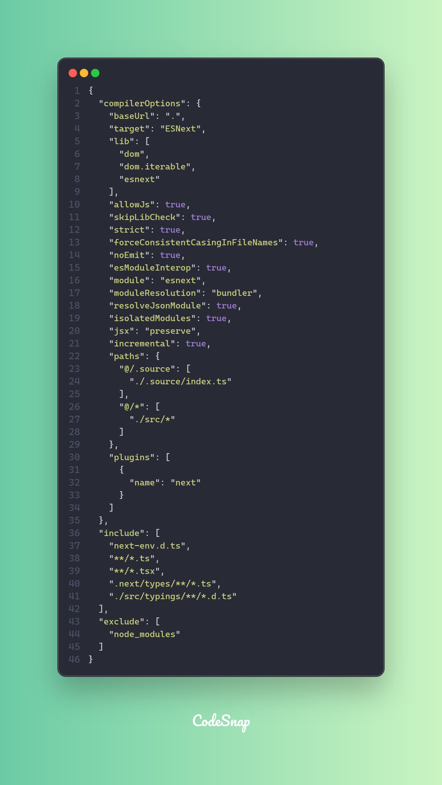
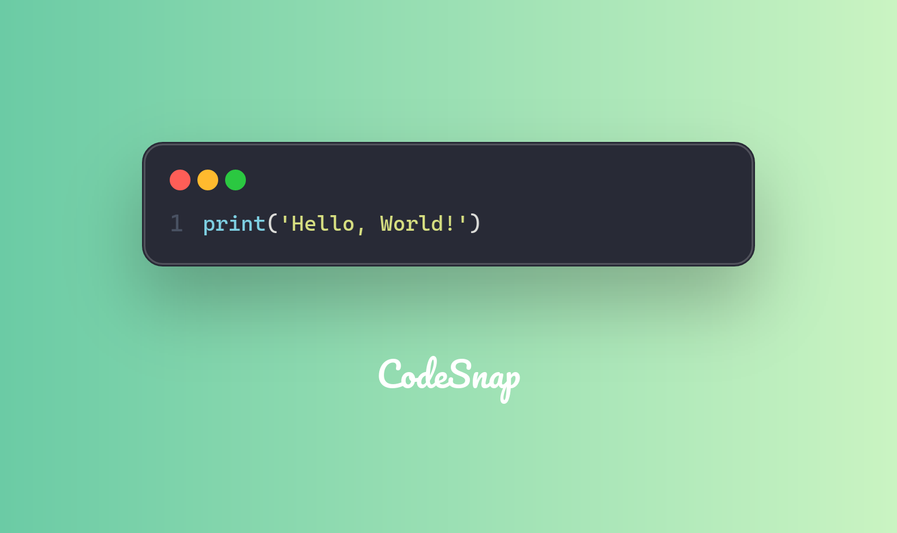
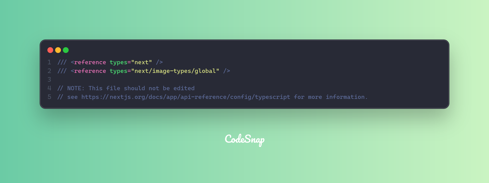

# Code Input

CodeSnap input type can be the following types:

- `file` - A file path to a code file
- `stdin` - A code input from stdin
- `string` - input code as a string
- `clipboard` - input code from clipboard

## Language

CodeSnap can auto detect what programming language is used based on code content, but it's not always accurate, we recommend to specify the language explicitly or you can capture a file directly.

## File input

Generate a code snapshot from a file is the most common use case. You can specify the file path using `--from-code` or `-f` flag.

```bash
codesnap -f <file_path> -o clipboard
```



## From code

You can also provide a code snippet directly using `--from-code` or `-c` flag. This is useful for quick code snippets or when you don't want to create a file.

```bash
codesnap -c "print('Hello, World!')" -l "py" -o clipboard
```



## From stdin

If you want to provide a code snippet form stdin, you can also use `--from-code` or `-c` flag.

```bash
cat ./next-env.d.ts | codesnap -c -l ts -o content/docs/cli/stdin-input.png
```


