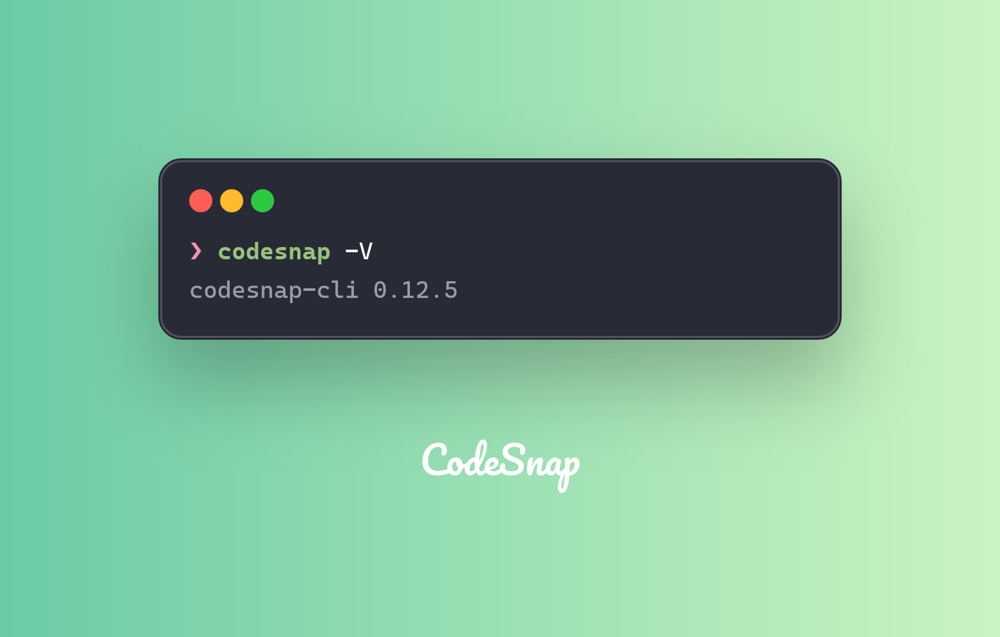

Generate snapshots of command outputs is a powerful feature of CodeSnap CLI. It allows you to capture the output of any command and create a visually appealing snapshot.

## Basic usage

You can simply put your command to the `execute` option, and codesnap will execute it and capture the output.

```bash
codesnap --execute "codesnap -V" -o clipboard
```



## Skip run the command

If you want to capture the command output without executing it, you can use the `--skip` option. This is useful when you want to capture the command itself, not its output.

```bash
codesnap --execute "codesnap -V" --skip -o clipboard
```


