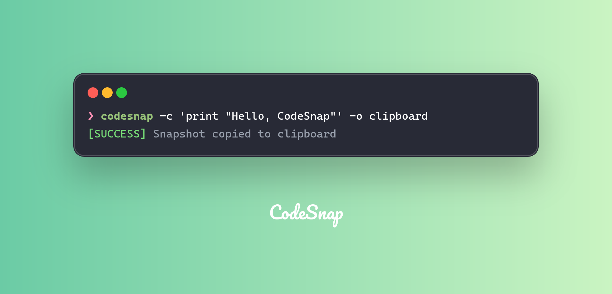

## Installation

CodeSnap CLI distribution is available on multiple platforms. You can install it using the package manager of your choice.

**Arch Linux**

```bash
sudo pacman -S codesnap
```

**Cargo**

```bash
cargo install codesnap-cli
```

Or install via precompiled binary:

```bash
cargo binstall codesnap-cli
```

**Homebrew**

```bash
brew install codesnap
```

**Nix/NixOS**

```bash
nix-env -i codesnap
```

Now let's generate your first code snapshot using CodeSnap CLI.


