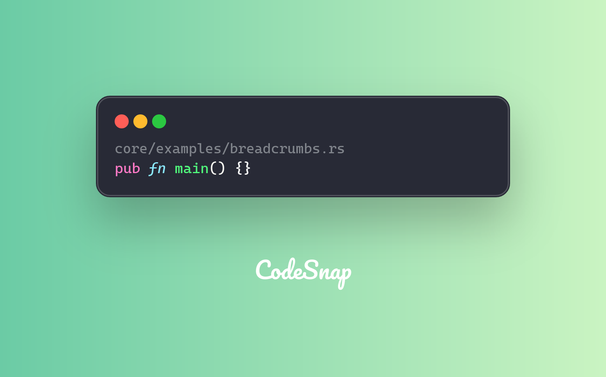
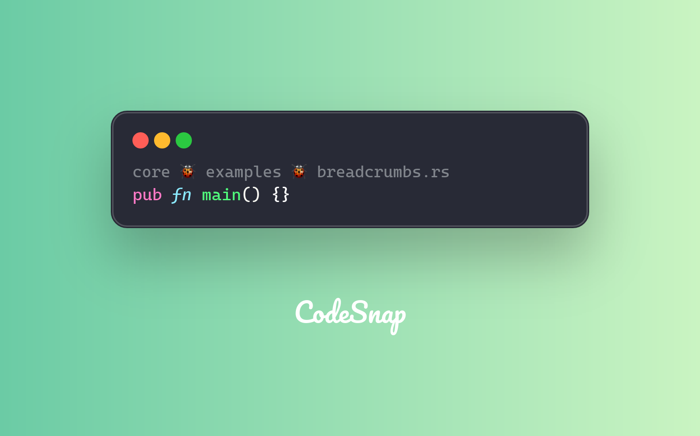

Breadcrumbs are a powerful feature in CodeSnap that allows you to add context to your code snippets. They can be used to indicate the file path, helps viewers understand the code better.

First, you need to enable breadcrumbs:

```rust
let code_content = Content::Code(
    CodeBuilder::default()
        .content(r#"pub fn main() {}"#)
        .language("rust")
        .file_path(
            "https://github.com/codesnap-rs/codesnap/blob/main/core/examples/breadcrumbs.rs",
        )
        .build()?,
);

let breadcrumbs = BreadcrumbsBuilder::default().enable(true).build()?;
let code_config = CodeConfigBuilder::default()
    .breadcrumbs(breadcrumbs)
    .build()?;

let snapshot = CodeSnap::from_default_theme()?
    .content(code_content)
    .code_config(code_config)
    .build()?
    .create_snapshot()?;
```

The output will be like this:


## Custom breadcrumbs separator

You can also customize the breadcrumbs separator, which is a string that will be used to separate the breadcrumbs. By default, it is set to `"/"`, but you can change it to any string you want.

```rust
let breadcrumbs = BreadcrumbsBuilder::default()
    .enable(true)
    .separator(" > ")
    .build()?;
```


Or more interesting, you can use a custom separator like this:

```rust
let breadcrumbs = BreadcrumbsBuilder::default()
    .enable(true)
    .separator(" 🐞 ")
    .build()?;
```


