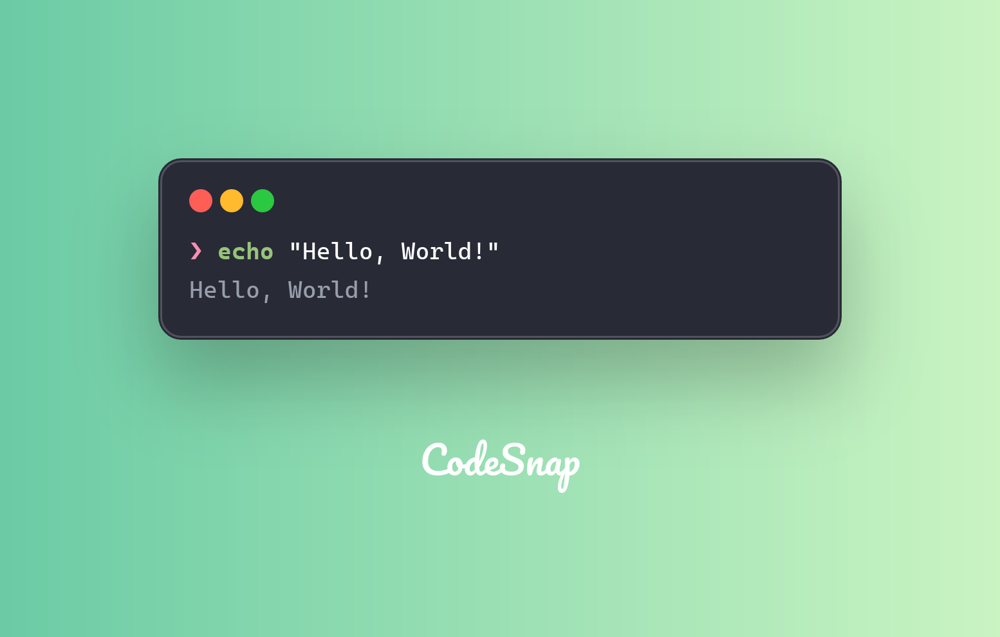

CodeSnap can generate snapshots of command output, let's see how to do it.

```rust
let command = "echo \"Hello, World!\"";
let output = Command::new("sh")
    .arg("-c")
    .arg(command)
    .output()
    .expect("failed to execute process");

let command_line_content = CommandLineContentBuilder::default()
    .full_command(command)
    .content(String::from_utf8_lossy(&output.stdout).into_owned())
    .build()
    .unwrap();

let command_content = Content::CommandOutput(vec![command_line_content]);
let snapshot = CodeSnap::from_default_theme()?
    .content(command_content)
    .build()?
    .create_snapshot()?;
```



Also support multiple colorful command output:

```rust
let command = r#"echo 'I \033[0;31mlove\033[0m CodeSnap!'"#; // [!code highlight]
let output = Command::new("sh")
    .arg("-c")
    .arg(command)
    .output()
    .expect("failed to execute process");

let command_line_content = CommandLineContentBuilder::default()
    .full_command(command)
    .content(String::from_utf8_lossy(&output.stdout).into_owned())
    .build()
    .unwrap();

let command_content = Content::CommandOutput(vec![command_line_content]);
let snapshot = CodeSnap::from_default_theme()?
    .content(command_content)
    .build()?
    .create_snapshot()?;
```


