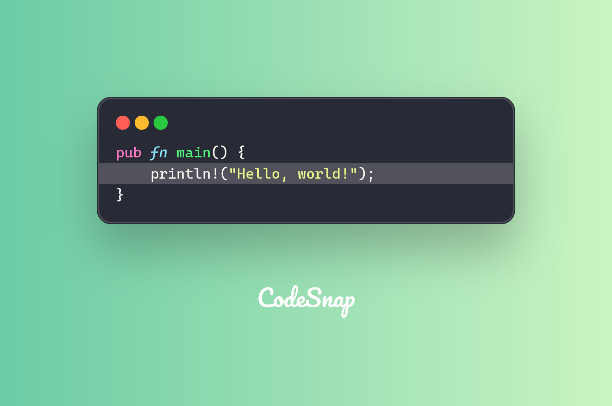

Sometimes you might want to highlight specific lines in your code. CodeSnap provides a simple way to do this.

## Highlighting lines

CodeSnap allows you to highlight multiple lines or specific lines in your code, with custom colors.

For example, you want to highlight the second line:

```rust
let code_content = Content::Code(
    CodeBuilder::default()
        .content(
            r##"pub fn main() {
println!("Hello, world!");
}"##,
        )
        .language("rust")
        .highlight_lines(vec![HighlightLine::Single(2, "#ffffff30".to_string())]) // [!code highlight]
        .build()?,
);

let snapshot = CodeSnap::from_default_theme()?
    .content(code_content)
    .build()?
    .create_snapshot()?;
```



## Highlighting colorful lines

White is boring, so you can use any color you want to highlight the lines.

For more interesting, you can use red and green to indicate the changes in your code:

```rust
let code_content = Content::Code(
    CodeBuilder::default()
        .content(
            r##"pub fn main() {
println!("Hello, world!");
println!("Hello, CodeSnap!");
}"##,
        )
        .language("rust")
        .highlight_lines(vec![
            HighlightLine::Single(2, "#ff6b6b30".to_string()), // [!code highlight]
            HighlightLine::Single(3, "#2ecc7130".to_string()), // [!code highlight]
        ])
        .build()?,
);
```


