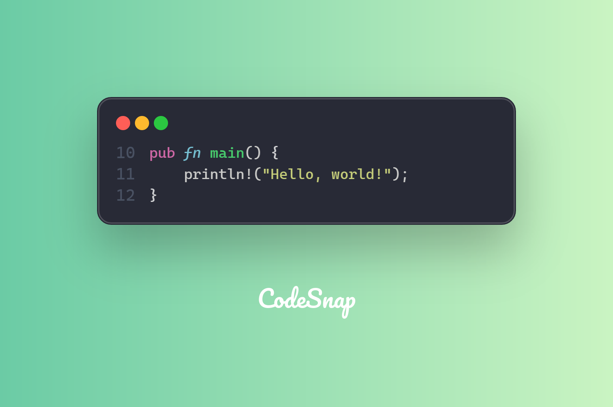

CodeSnap supports render line numbers in code snapshots, which can be useful for referencing specific lines of code. You can enable or disable line numbers in the `Code` configuraion:

```rust
#[derive(Clone, Builder, Serialize, Deserialize, Debug, JsonSchema)]
pub struct Code {
    #[builder(setter(into))]
    pub content: String,

    #[builder(default = false)]
    pub has_breadcrumbs: bool,

    #[builder(setter(into, strip_option), default = None)]
    pub start_line_number: Option<u32>,

    #[builder(setter(into), default = vec![])]
    #[serde(default)]
    pub highlight_lines: Vec<HighlightLine>,

    /// The `language` will be used to determine the syntax highlighting to use for generating
    /// the snapshot.
    #[builder(setter(into, strip_option), default = None)]
    pub language: Option<String>,

    #[builder(setter(into, strip_option), default = None)]
    pub file_path: Option<String>,
}
```

For instance, if your code snippet is start from like 10, then you can set the `start_line_number` to 10:

```rust
let code_content = Content::Code(
    CodeBuilder::default()
        .content(r#"pub fn main() {
            println!("Hello, world!");
        }"#)
        .language("rust")
        .start_line_number(10u32)
        .build()?,
);

let snapshot = CodeSnap::from_default_theme()?
    .content(code_content)
    .build()?
    .create_snapshot()?;
```

The output will be like this:


