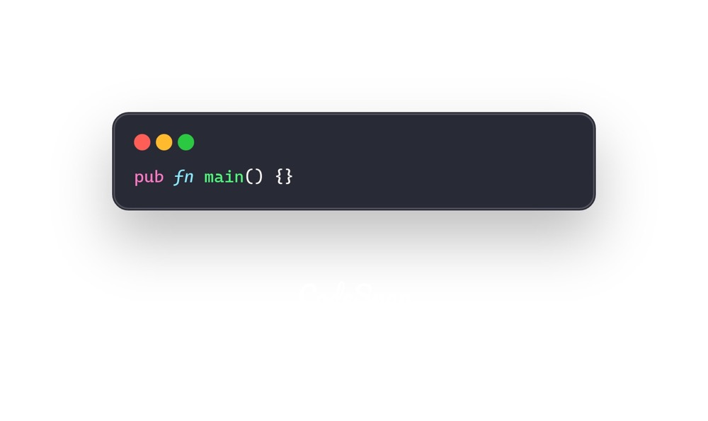
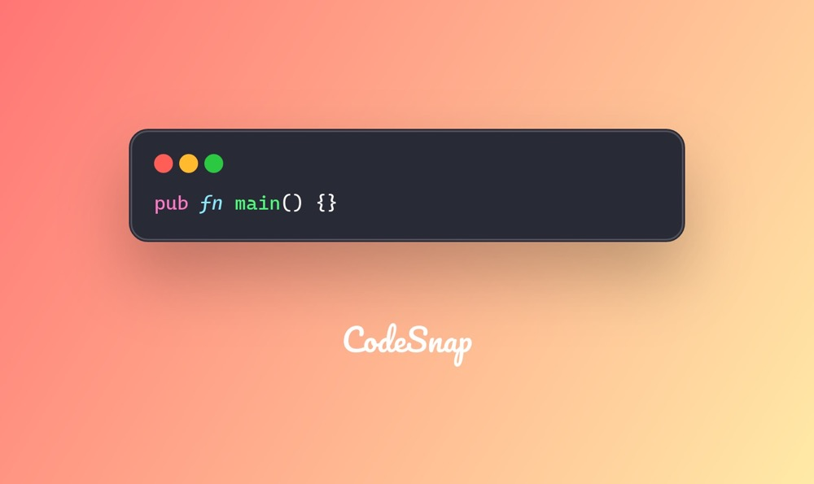

Theme is a powerful feature of CodeSnap that allows you to customize the appearance of your code snippets. The theme is mainly divided into two parts:

- **Background**: The background of the code snippet, which can be a solid color or a gradient.
- **Code**: The code itself, which can use `.tmTheme` file to customize the syntax highlighting.

## Custom background

Let's say we want a white solid background code snapshot:

```rust
let code_content = Content::Code(
    CodeBuilder::default()
        .content(r#"pub fn main() {}"#)
        .language("rust")
        .build()?,
);

let snapshot = CodeSnap::from_default_theme()?
    .background(Background::Solid("#ffffff".to_string()))
    .content(code_content)
    .build()?
    .create_snapshot()?;
```



Or we can use a gradient background:

```rust
let snapshot = CodeSnap::from_default_theme()?
    .background(Background::Gradient(LinearGradient {
        start: GradientPoint {
            x: DimensionValue::Num(0.),
            y: DimensionValue::Num(0.),
        },
        end: GradientPoint {
            x: DimensionValue::Max,
            y: DimensionValue::Max,
        },
        stops: vec![
            LinearGradientStop::new(0.0, "#ff7675"),
            LinearGradientStop::new(1.0, "#ffeaa7"),
        ],
    }))
    .content(code_content)
    .build()?
    .create_snapshot()?;
```



## Custom code theme

CodeSnap uses `syntect` for syntax highlighting, which is a Rust port of the Sublime Text syntax highlighter. It provides support for a wide range of programming languages and themes.
So you can use any `.tmTheme` file to customize the syntax highlighting.

### Step 1: put your `.tmTheme` file in somewhere

You can put your `.tmTheme` file in any directory, but for this example, we will put it in the `assets` directory.

### Step 2: load the theme file

Let CodeSnap know where to find the theme file, use `themes_folders` to load the directory where the theme file is located.

For example: `./assets/themes`

```rust
let snapshot = CodeSnap::from_default_theme()?
    .themes_folders(vec!["./assets/themes".to_string()]) // [!code highlight]
    .content(code_content)
    .build()?
    .create_snapshot()?;
```

### Step 3: use the theme

You can use the `theme` method to set the theme for the code snippet.

For example: `OneDark`

```rust
let snapshot = CodeSnap::from_default_theme()?
    .themes_folders(vec!["./assets/themes".to_string()])
    .theme("OneDark".to_string()) // [!code ++]
    .content(code_content)
    .build()?
    .create_snapshot()?;
```

Now enjoy the new theme!
