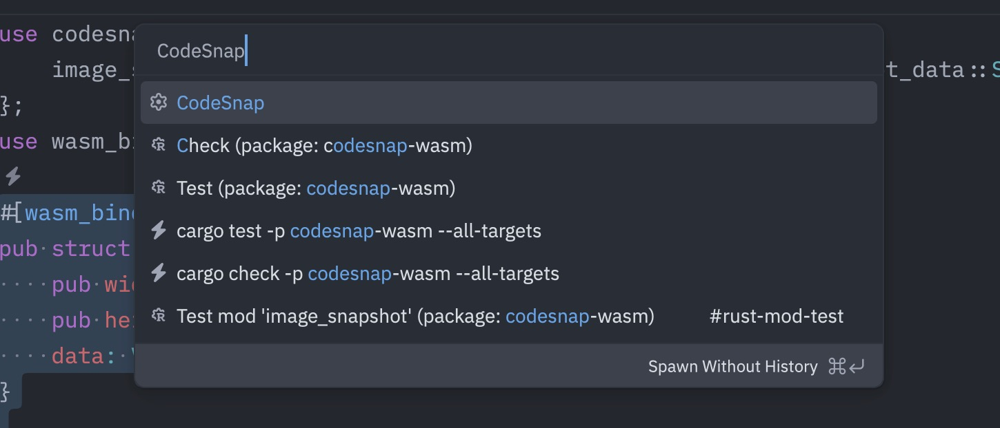

Integrate CodeSnap with Zed is straightforward. Zed provides a powerful feature called "Tasks" that allows you to run commands directly from the editor. This makes it easy to generate code snippets using CodeSnap.

Let's walk through the steps to set up CodeSnap in Zed:

## Step 1: Install CodeSnap

Follow the [Installation](/docs/cli) instructions to install CodeSnap CLI in your system.

## Step 2: Create a Task in Zed

Recommend to create a global task in Zed for CodeSnap, so you can use it across all your projects. To do this, follow these steps:

1. Create a file named `tasks.json` in your Zed configuration directory (usually `~/.config/zed`).
2. Add the following content to the `tasks.json` file:

```json
[
  {
    "label": "CodeSnap",
    "command": "codesnap --watermark CodeSnap.zed -o clipboard --file-path \"$ZED_RELATIVE_FILE\" --has-line-number --start-line-number $ZED_ROW --has-breadcrumbs true -c",
    "args": ["\"$ZED_SELECTED_TEXT\""],
    "use_new_terminal": false,
    "allow_concurrent_runs": false,
    "reveal": "never",
    "reveal_target": "dock",
    "hide": "on_success",
    "shell": "system"
  }
]
```

## Step 3: Take a code snapshot

1. Open the file you want to take a snapshot of in Zed.
2. Select the code you want to include in the snapshot.
3. Open the command palette (usually `Cmd+Shift+P` or `Ctrl+Shift+P`).
4. Type `task:spawn` and select the `CodeSnap` task you created.
5. The code snapshot will be generated and copied to your clipboard.


